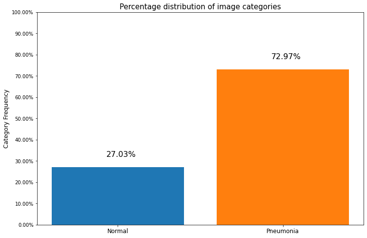
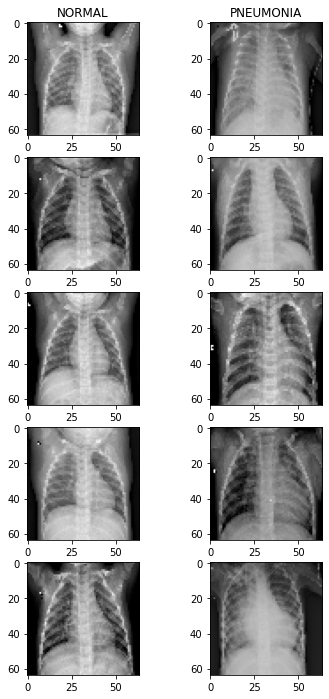
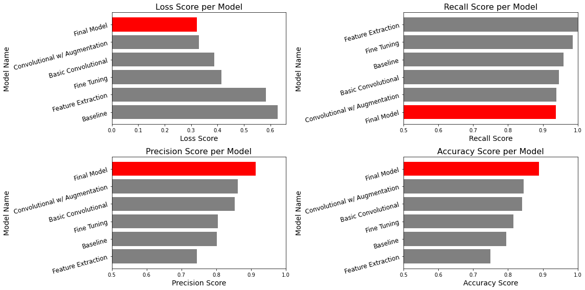
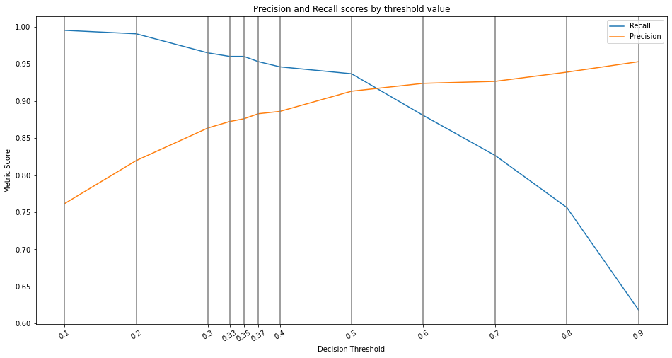
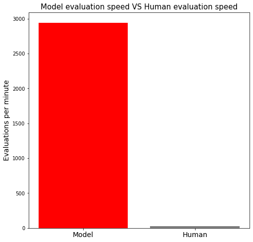

# Pneumonia Image Classification Project
**Author:** Kai Uechi

## Overview
The purpose of this project is to create a model that can identify the presense of pneumonia from chest x-rays. After iterating through multiple model designs, a convolutional neural network trained on the dataset was able to identify pneumonia in an infected patient's x-ray 95% of the time. This model has the potential to save significant time and money, as an evalutation of an x-ray by the model takes only 19 milliseconds on average. However, the model's performance could be improved with more x-rays to help balance the classes in the dataset.

## Business Problem
A radiology consultancy is looking to automate some of their work. While the consultancy as a whole specializes in providing detailed analyses of radiographs, a particularly common task for the consultancy is identifying cases of pneumonia from chest x-rays. Using neural networks, it may be possible to identify these cases more efficiently than is possible using manual analysis, saving both money and time.

## Data Understanding

This project's dataset consists of 5,856 chest x-rays collected from pediatric patients. Notably, of the 5,856 total images, 4,273 of the x-rays show a patient suffering from pneumonia. Although class imbalances are common in medical datasets, frequently the illness is the minority class rather than the other way around.

The images are greyscale, and the sizes and aspect ratios of the images vary.
Most images show the whole torso, but some are zoomed in on the lungs.

Below is a graph of the class distribution as well as a small sample of images from each category.





## Data Preprocessing
The images have been arranged into train, test, and validation sets. The train set recieves 80% of the images, while test and validation sets each recieve 10%.

Next, the images are resized to the aspect ratios 512x512, 128x128, and 64x64. 
This ensures input consistency and allows for efficient training performance.

In the case of most models, only a subset of the images are used. This is done to allow for model iteration and tuning within a reasonable amount of time.

Some models also utilize data augmentation, which applies various transformations to the training set.

## Modeling

In this section, several types of neural networks are trained and evaluated on the dataset. For each model, graphs are created of the model's performance in four tracked metrics (Accuracy, Recall, Precision, and Loss). For the sake of space, these graphs are excluded from this readme, but you can view them in the notebook. 

The following types of models are used:
* `Densely Connected Neural Network`
* `Convolutional Neural Network`
* `Transfer Learning Neural Network`

First, a simple `Densely Connected` model is created as a baseline. Then, a `Basic Convolutional` model is created, which outperforms the baseline. An `Updated Convolutional` model utilizing data augmentation improves performance again. Next, `Transfer Learning` models are trained on the dataset. However, these models do not meet the performance of the previous convolutional models. A `Final Model` based on the updated convolutional model is created and trained on the entire dataset at a higher image resolution. As expected, this final model has the best performance.

## Conclusion

### Model Evaluation

When evaluated on it's test set, the final model achieved superior scores compared to previous models. In general, these scores tended to be just above the Convolutional w/ Data Augmentation model that the final model was based on. The points below discuss the details of the final model's performance:

* Loss:
    * The final model achieved a loss of 0.32, the best loss overall. 
    * This is an improvement of 0.01 over the next best score.
* Recall:
    * The final model's recall score is 0.93, the lowest of all models. 
    * However, although the final model's recall score is lower, its superior performance in other metrics allows it to achieve a better balance of recall and precision.
* Precision:
    * The final model achieved a precision score of 0.91, the best by a significant margin. 
    * Compared to the Convolutional w/ Data Augmentation model, the final model's precision is 0.05 greater.
* Accuracy:
    * The final model's accuracy score is 0.89, once again the best out of all of the models.
    * The next highest accuracy score is 0.85

The graphs below visualize the performance of each model by metric. The final model is marked in red.



### Decision Threshold Tuning

Although the final model performs well, simply focusing on loss or accuracy is not appropriate given that the business problem is of a medical context. In this case, a false positive is prefered to a false negative. Considering this, a custom decision threshold is used to further tune the model's predictions. Ultimately, a threshold of `0.37` was chosen to maintain good precision while having very high recall. 

The cell below calculates the effects of this decision threshold, allowing the model to achieve a recall score of `0.95` while still maintaining a precision score of `0.88`.

The graph further below visualizes the effects of various decision thresholds on the model's precision and recall.



### Model Efficiency Compared to Human Evaluation

For the specific task of identifying pneumonia from a chest x-ray, a trained radiologist could likely complete an evaluation in a matter of seconds. Even so, the speed of the final model far exceeds human capability.

A human could likely complete evaluations with an average time as fast as 2 seconds. The final model, on the other hand, can evaluate all 585 images in the test set in around 11 seconds. This gives the model an average speed of approximately 19 milliseconds per image, making the model 105 times faster than a human radiologist.

The graph below visualizes how many evaluations a human and the final model would each be able to complete in 1 minute.



### Model Deployment Considerations

The performance of the final model is very good, as it can detect a case of pneumonia 95% of the time, with a false positive rate of only 12%. With this sort of identification ability, the model could be effectively deployed for use. Doing so would save the consultancy both money and time.

The model could be used internally by consultancy radiologists to quickly identify cases of pneumonia. Additionally, radiologists could view the model's raw predictions before they are put through the decision threshold. That way, radiologists would be able to focus on manually checking the predictions that the model is least confident in.

Alternatively, if the model is deployed as a webapp, customers who send in x-rays to be analyzed by the consultancy could instead send their data directly to the model. The benefit of this is that customers would recieve results almost instantly, without requiring the direct action of consultancy radiologists. It is important to note, however, that this particular method of deployment raises security concerns. Therefore, if deploying the model as a webapp, the consultancy would need to ensure patient medical data is secure while being sent online.

### Next Steps
* **Gather more data**
    * The model's perfomance could be improved further with additional labeled data to train on. X-rays of healthy patients should be prioritized, as this will address the class imbalance that currently exists in the dataset.
* **Purchase/rent more computing resources**
    * With currently available computing power, tuning the parameters of the model further will be difficult and time consuming. Given more resouces, however, further tuning could improve the model.
* **Collect data on other illnesses**
    * The performance of the final model is promising. It's likely that other illnesses could be identified by machine vision with similar effectiveness. Therefore, data on additional illnesses should be collected for use with future models.

## For More Information

Review the [Jupyter Notebook](./pneumonia-image-classification.ipynb) or the [presentation](./pneumonia-image-classification_ProjectPresentation.pdf).

For any additional questions, please contact **Kai Uechi (kaiuechi@gmail.com)**

## Repository Structure
***

    ├── data  -Contains the dataset, as well as its resized variants
    ├── images  -Contains images used in README
    ├── models  -Contains neural network models and their training history
    ├── README.md  -Overview of project and repo contents
    ├── pneumonia-image-classification_ProjectPresentation.pdf  -A slide deck for presenting this project
    └── pneumonia-image-classification.ipynb  -The final notebook for this project.

```python